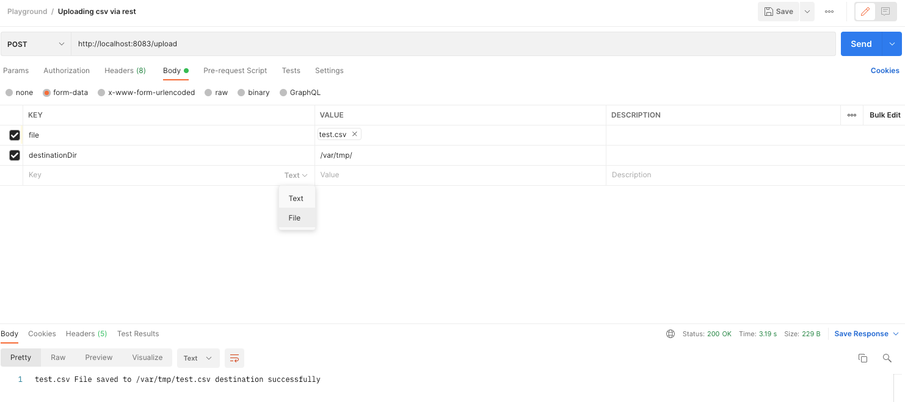

# file uploader

- Web application to accept and write a file on server using POST REST Request

## About the web application
- Problem statement
    - You want to upload a file to the webserver using POST (REST) request
- Solution
    - You can upload files using <a href="https://swagger.io/docs/specification/describing-request-body/multipart-requests/">multipart HTTP request</a>
    - Spring allows you to do it by using MultipartFile (commons-fileupload dependency)

## Steps to run the application locally
- Clone the project
- Import project in your favourite IDE
- Build the gradle project
- Run the main method (DriverMain.java)

## Test the application
- Setup and run postman
- Upload test.csv file (select type as file via the dropdown on value cell)

- File should be available in the destination directory on the server
